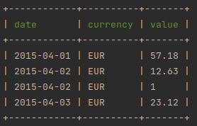
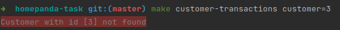

# Homepanda Task

## Description
This project allows you to view the list of transactions carried out by a specific customer.
The value of the transactions is converted into euros

The project was implemented using:
- docker and docker-compose
- php 8.1
- symfony
- postgresql

## Installation

Clone the repository:
```
git clone git@github.com:fpiccolo/homepanda-task.git
```

---

To initialize the project with the Make file:
```
make init
```
This command do:
- builds the docker images
- pulls up the containers
- initializes the database
- runs the migrations
- runs the fixtures

---

To turn off the environment:
```
make down
```
---
To turn on the environment:
```
make up
```

To go inside the php container:
```
make sh
```
---
To run the tests:
```
make test
```
---
To destroy the environment:

```
make destroy
```

This command downs the environment and deletes the volumes

## List of transactions

### With command line
To see a customer's transactions run this command passing a customer's id as a parameter.

In the database there are only customers with id 1 and 2

```
make customer-transactions customer=1
```

Example result:



Example error with wrong customer id:



### With HTTP request

You can view the list of transactions by making an HTTP call to the following url:
`http://127.0.0.1:8080/customer/{customerId}/transactions`

Example call with curl:
```
curl --location --request GET 'http://127.0.0.1:8080/customer/1/transactions'
```

Example result:
```json
[
    {
        "date": "2015-04-01",
        "currency": "EUR",
        "value": 57.18
    },
    {
        "date": "2015-04-02",
        "currency": "EUR",
        "value": 12.63
    },
    {
        "date": "2015-04-02",
        "currency": "EUR",
        "value": 1
    },
    {
        "date": "2015-04-03",
        "currency": "EUR",
        "value": 23.12
    }
]
```

Example error response:
```json
{
    "message": "Customer with id [3] not found",
    "code": 404
}
```